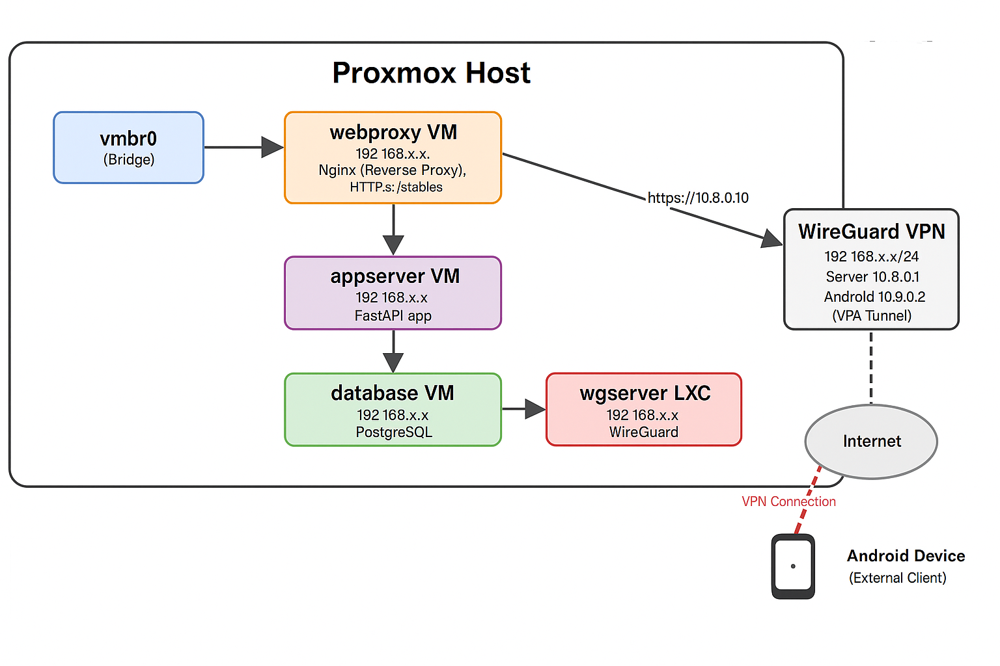

# Secure Self-Hosted Infrastructure - Proxmox Home Lab

## Overview

This repository documents a secure, self-hosted home lab infrastructure built on Proxmox. It features virtual machines and containers hosting key services, integrated with a WireGuard VPN for secure remote access.

The setup focuses on separation of concerns, hardened security, and ease of access via VPN.

---

## Architecture

### Components

| Hostname   | Type | IP Address(es)              | Description                                                    |
|------------|-------|----------------------------|----------------------------------------------------------------|
| `webproxy` | VM    | LAN: 192.168.x.x   VPN: 10.8.0.10 | Nginx reverse proxy with HTTPS and iptables firewall |
| `appserver`| VM    | 192.168.x.x                          | Docker-hosted FastAPI application                    |
| `database` | VM    | 192.168.x.x                          | PostgreSQL database with backups                     |
| `wgserver` | LXC   | LAN: 192.168.x.x   VPN: 10.8.0.1  | WireGuard VPN server with NAT and routing            |

---

## Network

- Proxmox host bridge: `vmbr0` connected to MikroTik router providing DHCP and routing.
- LAN subnet: `192.168.x.x/24`
- VPN subnet: `10.8.0.0/24`
- VPN clients connect securely to the WireGuard server (`10.8.0.1`) and can access internal services such as the Nginx proxy at `10.8.0.10`.

---

## VPN Client Access

- The Android device running WireGuard connects to the VPN subnet.
- Access internal services via VPN IPs, e.g., `https://10.8.0.10` for the Nginx reverse proxy.

---

## Getting Started

### Prerequisites

- Proxmox VE installed and configured
- MikroTik router configured for LAN DHCP and routing
- Basic knowledge of Linux networking, WireGuard, Docker, and PostgreSQL

### Installation Steps

1. **Deploy VMs and LXC container** on Proxmox with the specified IPs.
2. **Configure WireGuard VPN** on the LXC container (`wgserver`), including NAT and iptables forwarding.
3. **Set up Nginx reverse proxy** on `webproxy`, listening on VPN IP `10.8.0.10`.
4. **Deploy FastAPI app** inside Docker on `appserver`.
5. **Configure PostgreSQL** on `database` with backups.
6. **Test VPN connectivity** and service access from the Android client.

---

## Security Considerations

- iptables firewall enabled on `webproxy` to limit exposed ports.
- WireGuard VPN encrypts remote traffic.
- PostgreSQL is secured and regularly backed up.
- Docker containers isolated on `appserver`.

---

## License

This project is licensed under the MIT License. See the [LICENSE](LICENSE) file for details.

---

## Contact

For questions or contributions, please open an issue or submit a pull request.

---

